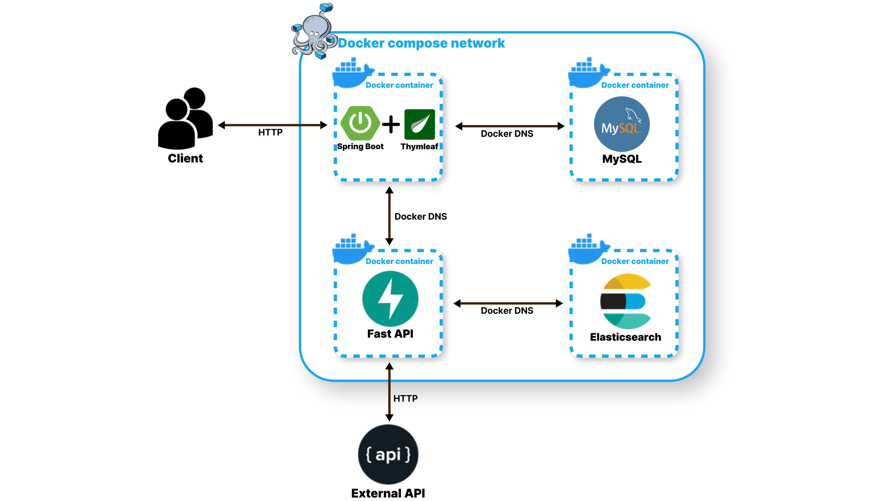
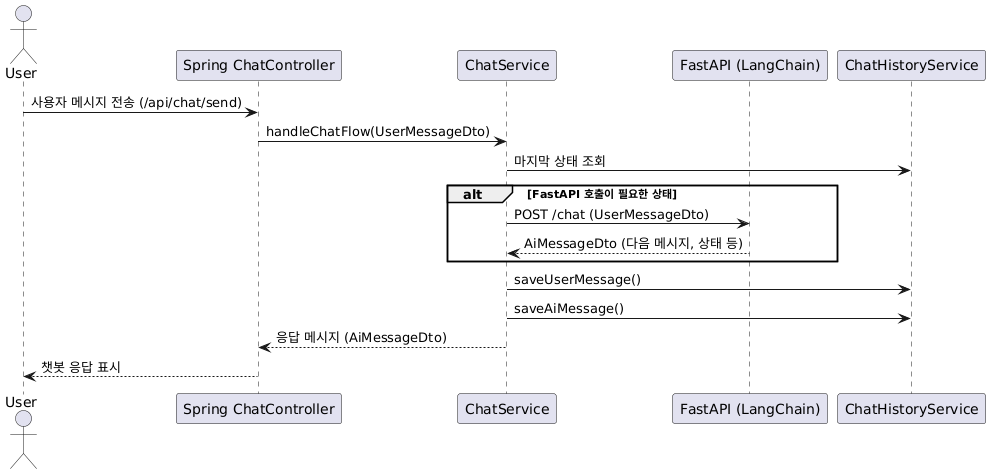

# 📚 AI 기반 학습 도우미 시스템

> Spring Boot + Thymleaf + FastAPI + LangChain + MySQL + Elasticsearch 기반의 실시간 개인화 학습 지원 플랫폼

---

## 🧠 주요 서비스 개요

> 사용자가 직접 업로드한 PDF 파일 기반으로 학습을 도와주는 개인화 챗봇 시스템입니다. 사용자는 노트를 남기고, 챗봇에게 예상 문제를 요청하거나, 특정 개념을 설명받는 등의 상호작용을 통해 반복 학습 → 오답 분석 → 피드백 → 보충 설명의 과정을 자연스럽게 이어갈 수 있습니다.

---

## 🖼️ 시스템 아키텍처



---

## 🧱 시스템 개요

본 시스템은 Docker Compose 네트워크 기반의 멀티 컨테이너 아키텍처로, Spring Boot, FastAPI, MySQL, Elasticsearch 등 주요 컴포넌트를 통합하여 다음과 같은 기능을 제공합니다:

- ✍️ 노트/메모 기반 학습 지원
- 💬 상태 기반 챗봇과의 자연스러운 대화 흐름
- 🧠 LangChain 기반 문제 생성 및 오답 피드백
- 🔍 Elasticsearch를 통한 교재 검색 및 유사 문서 탐색

---

## ⚙️ 기술 스택

| 구분 | 기술 |
|------|------|
| **프론트엔드** | Thymeleaf (Spring 기반 SSR) |
| **백엔드 (메인)** | Spring Boot (Java 17) |
| **AI 서버** | FastAPI (Python 3.10) + LangChain |
| **데이터베이스** | MySQL 8.0 |
| **검색엔진** | Elasticsearch 8.x |
| **컨테이너화** | Docker, Docker Compose |
| **LLM 연동** | OpenAI GPT-4 API |
| **문서 검색 최적화** | RAG (Retrieval-Augmented Generation) 기반 구조 |

---

## 📌 주요 구성 요소 및 역할

| 구성 요소                     | 역할                              |
|---------------------------| ------------------------------- |
| 👥 사용자                    | 웹 UI에서 챗봇과 상호작용, 노트 작성, PDF 열람  |
| 🌱 Spring Boot + Thymleaf | 상태 제어, 사용자 인증, PDF 렌더링 및 노트 관리  |
| ⚡ FastAPI (LangChain)     | 예상 문제 생성, 오답 분석, 개념 설명 (LLM 호출) |
| 🔎 Elasticsearch          | 교재 문서 임베딩 및 RAG 기반 검색           |
| 🐬 MySQL                  | 사용자/노트/이력 정보 저장                 |
| 🌐 외부 API                 | 위키/백과 등을 통한 개념 설명 보강            |


---

## 🔁 주요 시나리오 흐름

### 🤖 챗봇 서비스 흐름 및 시퀀스 다이어그램

```plaintext
[사용자 요청]
     ↓
[Spring ChatService: 상태 판단 + 흐름 제어]
     ↓                     ↘️
[상태 전이에 따른 로직 처리]  → (필요 시) [FastAPI (/chat)] 호출
     ↓
[다음 상태 + 메시지 결정]
     ↓
[ChatHistory 저장 + 응답 반환]
```



### 🤖 AI 학습 도우미 챗봇(상태 기반 흐름)

```plaintext
📍 START → WAITING_USER_SELECT_FEATURE
         // 기능 선택 대기 (1. 문제 생성 / 2. 페이지 찾기 / 3. 개념 설명)

         ├─ 1. 예상 문제 생성
         │   → WAITING_PROBLEM_CRITERIA_SELECTION
         │     // 문제 기준 선택 요청
         │     → WAITING_PROBLEM_CONTEXT_INPUT
         │       // 챕터/개념 입력 요청
         │       → ⚡ GENERATING_QUESTION_WITH_RAG
         │         // FastAPI 호출로 문제 생성
         │         → ⚡ EVALUATING_ANSWER_AND_LOGGING
         │           // FastAPI 호출로 정오답 판단 및 해설 포함
         │           → WAITING_CONCEPT_RATING
         │             // 해설에 대한 이해도 평가 요청
         │             ├─ 4~5점 → WAITING_NEXT_ACTION_AFTER_LEARNING
         │             │           // 다음 행동 선택 (1. 다음 문제 / 2. 기능 선택)
         │             │           ├─ 1. 다음 문제 → ⚡ GENERATING_ADDITIONAL_QUESTION_WITH_RAG
         │             │           │                        → ⚡ EVALUATING_ANSWER_AND_LOGGING → ...
         │             │           └─ 2. 기능 선택 → WAITING_USER_SELECT_FEATURE
         │             └─ 1~3점 → WAITING_REASON_FOR_LOW_RATING
         │                          // 낮은 점수 이유 요청
         │                          → ⚡ REEXPLAINING_CONCEPT
         │                            // FastAPI 호출로 보충 설명
         │                            → WAITING_CONCEPT_RATING (반복)

         ├─ 2. 페이지 찾기
         │   → WAITING_KEYWORD_FOR_PAGE_SEARCH
         │     // 키워드 입력 대기
         │     → ⚡ PROCESSING_PAGE_SEARCH_RESULT
         │       // FastAPI 호출로 페이지/챕터 추천
         │       → WAITING_USER_SELECT_FEATURE (루프)

         └─ 3. 개념 설명
             → WAITING_CONCEPT_INPUT
             // 개념 입력 대기
               → ⚡ PRESENTING_CONCEPT_EXPLANATION
               // FastAPI 호출로 개념 설명
                 → WAITING_CONCEPT_RATING
                   // 설명에 대한 평가
                   ├─ 4~5점 → WAITING_NEXT_ACTION_AFTER_LEARNING → (선택에 따라 루프)
                   └─ 1~3점 → WAITING_REASON_FOR_LOW_RATING → ⚡ REEXPLAINING_CONCEPT → WAITING_CONCEPT_RATING (반복)
```


---

## 📂 프로젝트 디렉토리 구조

```plaintext
📦KDT_BE12_Toy_Project4/
├─ 📁 application-server/             # Spring Boot 애플리케이션
│  └─ 📁 application/                 # 핵심 서버 애플리케이션 모듈
│     ├─ 📁 src/                      # Java 소스 코드
│     ├─ 📜 build.gradle              # Gradle 빌드 스크립트
│     ├─ 📜 Dockerfile                # Spring Boot Dockerfile
│     └─ ...
│
├─ 📁 langchain-server/              # FastAPI + LangChain 기반 AI 서버
│  ├─ 📁 app/                         # FastAPI 라우터 및 서비스 코드
│  ├─ 📁 tests/                       # 테스트 코드
│  ├─ 📜 Dockerfile                   # FastAPI Dockerfile
│  ├─ 📜 Dockerfile.elasticsearch     # Elasticsearch 포함 빌드용 Dockerfile
│  └─ 📜 pyproject.toml              # Python 프로젝트 설정
│
├─ 📜 docker-compose.yml             # 전체 멀티 컨테이너 구성 파일
├─ 📜 .env.dev                        # 개발용 환경 변수
├─ 📜 .env.prod                       # 운영용 민감 정보 (Git 제외 권장)
├─ 📜 README.md
└─ ...
```

---

## 🐳 Docker 기반 환경 구성

### 📂 주요 서비스 요약

| 구성 요소                 | 설명                 | 호스트 포트 → 컨테이너 포트 |
| --------------------- | ------------------ | ---------------- |
| `Spring Boot`         | 사용자 API / View 렌더링 | `8080:8080`      |
| `MySQL`               | 관계형 데이터베이스         | `3307:3306`      |
| `FastAPI (LangChain)` | AI 기반 응답 처리        | `8000:8000`      |
| `Elasticsearch`       | 검색 기반 시스템          | `9200:9200`      |


### 🧭 네트워크 구성

- 모든 컨테이너는 Docker Compose의 `backend` 네트워크로 연결
- 내부 DNS 이름 (`mysql`, `langchain`, `elasticsearch`)으로 서로 접근

---

## 🔐 환경 변수 관리 전략

| 파일명         | 목적                                 | 비고                                     |
| ----------- | ---------------------------------- | -------------------------------------- |
| `.env.dev`  | **개발 환경용 설정** (DB 포트, 서비스 이름 등)    | 로컬 개발자들이 공통으로 사용할 수 있도록 Git에 포함        |
| `.env.prod` | **운영 또는 배포용 민감 정보** (API 키, 시크릿 등) | **보안상 Git에 포함 ❌**, 로컬 또는 서버에서 개별 관리 필요 |


### .env.prod 예시
```bash
OPENAI_API_KEY=sk-xxxxxxxxxxxx
OPENAI_MODEL_NAME=gpt-4
```

---


